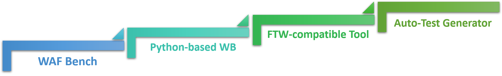

```
 __     __     ______     ______      ______     ______     __   __     ______     __  __    
/\ \  _ \ \   /\  __ \   /\  ___\    /\  == \   /\  ___\   /\ "-.\ \   /\  ___\   /\ \_\ \   
\ \ \/ ".\ \  \ \  __ \  \ \  __\    \ \  __<   \ \  __\   \ \ \-.  \  \ \ \____  \ \  __ \  
 \ \__/".~\_\  \ \_\ \_\  \ \_\       \ \_____\  \ \_____\  \ \_\\"\_\  \ \_____\  \ \_\ \_\ 
  \/_/   \/_/   \/_/\/_/   \/_/        \/_____/   \/_____/   \/_/ \/_/   \/_____/   \/_/\/_/ 
                                                                                             
```

# WAF Bench (WB) Tool Suits

WAF (Web Application Firewall) Bench tool suits is designed to verify the correctness and measure the performance of WAF.

## Motivation

### Real Traffic Performance Testing

The WAF's performance fluctuates greatly as the input traffic varies. The existing tool, i.e. `ab`, can test the perfromance under only one kind of customized request, which can not reproduce the real traffic scenario. In addition, `ab` can only customize some fields of the request, which is inconvenient for testing. 

In order to get the performance experienced by the real custumer and further improve WAF's efficiency, we build `wb`, an ab-like tool, which could send multiple and fully-customized packets in one invoking. Besides, WAF Bench tool suits accepts YAML-based input, which can customize your packet and reproduce multiple different packets easily. 

### Automatic WAF Correctness Testing

Automatic WAF correctness testing can relieve developers from the heavy and tedious verifying works. There are two important factors for conducting a WAF correctness testing: the testing framework and testcases.

For the testing framework, we provide a [FTW Compatible Tool](./FTW-compatible-tool/README.md) which leverages `wb` as its underlying tool. Its performance is better than FTW.

For testcases, we provide several generators for different purposes:

- Generate YAML files from the real traffic logs.
- Generate YAML files from the WAF ruleset.

Currently, they are still in development.

## Architecture



As you can see, WB Generator can provide all kinds of traffic based on real world, theory or special case. Taking generated requests as input, the Tester is able to read, send, receive and compare them with expected ones (ASAP, so benchmark also is available). Responder supports custom responses, which is very useful when testing real traffic.

## Features

- **Support Stress Performance Testing:** Generate the same traffic as Apache Bench (AB) and do the performance testing.
- **Support FTW Framework:** Generate the traffic from YAML files and do the correctness testing. 

## Usage

### Prerequisites

Some software or libraries may be necessary for further build / usage. All of them are listed below:

- **C Compiler** with good C11 support (tested with gcc 4.8)
- **C++ Compiler** with good C++11 support (tested with g++ 4.8)
- **pthread** library (tested with glibc 2.17, which includes pthread)
- **GNU Make** (tested with GNU Make 3.82)
- **libev** library (tested with libev 4.0.0)
- **CMake** 2.8 or higher (tested with CMake 2.8)
- **Boost** libraries (tested with 1.53.0)
- **Python** 2 (tested with 2.7.5) or **Python** 3 (tested with 3.4.8)
- **pip** python package management tool (tested with 8.1.2)
- **ftw** python module (tested with ftw 1.1.4)
- **wget** library (tested with wget-1.14-15.e17_4.1)
- **expat** library (tested with expat-devel-2.1.0-10.e17_3)
- **openssl** library (tested with openssl-devel-1.0.2k-12.e17)

The WB tool suites are developed and tested under CentOS 7 (Linux version 3.10, AMD 64 architecture) in a 32 core (Intel Xeon E5 @ 2.30GHz) Server.

**Note**: If you don't aim to conduct complex WAF testing tasks there is a *cheat sheet* below summarizing common testing instructions ranging from install to usage, by which you can focus on your goal; The *Advance Usage* section just gives you more detailed information of WB if considering it as a black box cannot satisfy your demand.

### Cheat Sheet

This tutorial is based on CentOS 7 (Linux version 3.10, AMD 64 architecture) but other Linux distributions is OK since there is no dependencies on CentOS.

#### Install Dependencies

##### On CentOS:

Before installing dependencies using yum in CentOS, we recommend you to enable the EPEL repo to find some packages listed below (`yum --enablerepo=extras install epel-release`).

However you can find these packages in your own source using 'yum search ...'

```
sudo yum install gcc gcc-c++ make                # Install build-essential
sudo yum install libev-devel.x86_64              # Install development headers for libev
sudo yum install cmake                           # Install CMake
sudo yum install boost-devel.x86_64              # Install boost libraries
sudo yum install python2                         # Install python2
sudo yum install python2-pip.noarch              # Install python2 pip
sudo pip install ftw                             # Install ftw module
sudo yum install wget.x86_64                     # Install wget
sudo yum install expat-devel                     # Install expat
sudo yum install openssl-devel                   # Install openssl
```

or just type

```
sudo yum install gcc gcc-c++ make libev-devel.x86_64 cmake boost-devel.x86_64 python2 python2-pip.noarch wget.x86_64 expat-devel openssl-devel
sudo pip install ftw
```

**Note**: Although the dependencies above need `python2`, FTW Compatible Tool Suits could works in `python3` without any modification.

#### Download WB tools suits 

Just clone this repo to your machines.

#### Install WB

Please refer to [WB Readme](./wb/README.md)

#### Conduct Performance Test / AB-like Test

Assuming that the server is at 10.0.1.1:18081 running we can:

```
wb -t 10 -c 20  10.0.1.1:18081
```

Or send requests from a file such as *requests.dat*:

```
wb -t 10 -c 25 -F requests.dat 10.0.1.1:18081
```

* About the format of request file, please refer to [WB Readme](./wb/README.md)

It is strongly recommended that use one of generators to generate request file from high level information rather than writing them by own.

Here is a example to use [YAML generator](./Generator/README.md):

```
cd example
../Generator/YAML_generator.py packets/test-1-packet.yaml -o /tmp/packet.pkt
wb -F /tmp/packet.pkt -c 20 -t 5 10.0.1.44:12701
```

You can also refer to `./example/WB-SEND-PACKET-FROM-YAML.sh`.

#### Conduct WAF Correctness Testing

* Please install the dependency library for FTW-compatible-tool first. You can refer to [FTW-compatible-tool Readme](./FTW-compatible-tool/README.md)
* We recommend you to mount the server's log file to client machine. For some helps, you may refer to [here](https://unix.stackexchange.com/questions/62677/best-way-to-mount-remote-folder). Assuming we mount it to */mnt/server/logs/error.log* 
* Assuming that the server is at 10.0.1.1:18081 running and we are in folder *FTW-compatible-tool/* we can:

```
./rtt.sh -d 10.0.1.1:18081 -y rtt_rules -l /mnt/server/logs/error.log
```

* Then we can use ftw_log_searcher to get more detailed info

### Advance Usage

Since the components are independent to each other, the detailed build, install and use tutorials are maintained in their own folder. You can access them at:

* [Generator](./Generator/README.md)
  * FTW-Compatible YAML Generator
* [wb](./wb/README.md)
* [FTW-Compatible Tool](./FTW-compatible-tool/README.md)

## Attributions

WB uses the following libraries.

```
Framework for Testing WAFs (FTW!)

https://github.com/fastly/ftw

Copyright 2016 Fastly
Licensed under the Apache License, Version 2.0 (the "License");
you may not use this file except in compliance with the License.
You may obtain a copy of the License at

http://www.apache.org/licenses/LICENSE-2.0

Unless required by applicable law or agreed to in writing, software
distributed under the License is distributed on an "AS IS" BASIS,
WITHOUT WARRANTIES OR CONDITIONS OF ANY KIND, either express or implied.
See the License for the specific language governing permissions and
limitations under the License.
```

## Changelog

For changelog, you may refer to [CHANGELOG.md](CHANGELOG.md).
